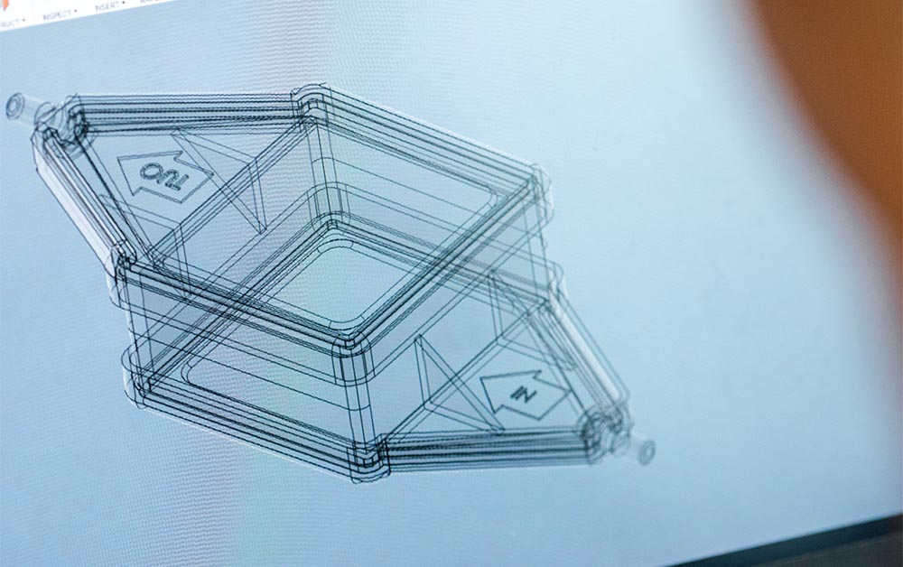

<!--- META
title=Great example test page
header_image=diag.jpg
publish_dfate=20201010
description=Example page showing varios graphical and typographical elements.
comments=3
tags=test,typographical, two word , powershell
author=John
-->

# Test

## Test

[other](/20201026-test_file.html)

### Test

#### Test

##### Test

this is a test

```python
for line in f:
    print("Hi")
```

*This text will be italic*
_This will also be italic_

**This text will be bold**
__This will also be bold__

_You **can** combine them_

* Item 1
* Item 2
  * Item 2a
  * Item 2b
  
```css
.meta-tags a {
    background-color: #ffea00;
    border: 2px solid transparent;
    color: #111;
    display: inline-block;
    margin-bottom: 5px;
    margin-right: 5px;
    padding: 1px 3px;
}
```

1. Item 1
1. Item 2
1. Item 3
   1. Item 3a
   1. Item 3b
   
<!--- breakout -->

<!--- breakin -->


http://github.com - automatic!
[GitHub](http://github.com)


"Lorem ipsum dolor sit amet, consectetur adipiscing elit, sed do eiusmod tempor incididunt ut labore et dolore magna aliqua. Ut enim ad minim veniam, quis nostrud exercitation ullamco laboris nisi ut aliquip ex ea commodo consequat. Duis aute irure dolor in reprehenderit in voluptate velit esse cillum dolore eu fugiat nulla pariatur. Excepteur sint occaecat cupidatat non proident, sunt in culpa qui officia deserunt mollit anim id est laborum."


"Lorem ipsum dolor sit amet, consectetur adipiscing elit, sed do eiusmod tempor incididunt ut labore et dolore magna aliqua. Ut enim ad minim veniam, quis nostrud exercitation ullamco laboris nisi ut aliquip ex ea commodo consequat. Duis aute irure dolor in reprehenderit in voluptate velit esse cillum dolore eu fugiat nulla pariatur. Excepteur sint occaecat cupidatat non proident, sunt in culpa qui officia deserunt mollit anim id est laborum."

It essentially comes down to one command: `Write-Progress -Activity 'thing that is running' -Status "Processed item number $count" -PercentComplete $percentComplete`

Lorem ipsum dolor sit amet, consectetur adipiscing elit. Nulla eu tincidunt ex. Aliquam erat volutpat. Pellentesque nisl mauris, elementum tempor suscipit nec, rhoncus molestie dolor. Praesent rutrum, sem quis rutrum fermentum, enim neque vulputate magna, sit amet fringilla felis tortor bibendum orci. Aliquam iaculis mollis arcu ac consectetur. Nam eu metus id quam viverra efficitur. Nam hendrerit ex lorem, et vehicula dolor commodo non. Duis ac velit vel eros interdum maximus eget vitae ligula. Aenean rutrum viverra tortor, ac consequat odio lobortis sit amet. Nullam tempus mi sed posuere rutrum. Nunc ut velit et sem tempus interdum. Duis aliquet mauris quis diam viverra efficitur. Ut et finibus tellus.

Phasellus faucibus efficitur mauris sit amet interdum. Nullam aliquet ex vitae faucibus tempus. Aliquam vestibulum mauris augue, eget volutpat lectus posuere ac. Aenean ultricies nisl sed dictum consectetur. Quisque rhoncus nibh ac molestie efficitur. Morbi ac fermentum nisl. Nulla volutpat pharetra odio id lacinia. In ultricies ligula sit amet purus viverra, ut pellentesque est commodo. Aliquam non ligula aliquet, dignissim massa aliquet, facilisis ex. Sed sed tincidunt tellus. Donec eget fringilla erat. In volutpat, nisi id imperdiet malesuada, nibh elit gravida sem, eu tincidunt mi nulla ac dolor. Nullam at gravida ex. Suspendisse sed tellus sit amet ex dignissim ullamcorper ac non dui. Curabitur tincidunt ullamcorper pretium.

double edit 2

Nam non felis mauris. Vivamus luctus vulputate neque, non hendrerit leo dapibus ac. Nunc ut nunc sit amet urna aliquam ornare vitae a erat. Morbi fringilla, lectus a viverra tempus, nisi turpis placerat nibh, sed dapibus neque ligula ac eros. Etiam fermentum dui arcu, ac consequat ligula luctus in. Pellentesque consectetur dapibus lectus. Pellentesque finibus turpis venenatis ligula consequat dictum. Morbi sit amet metus accumsan, convallis quam a, accumsan lectus. Donec non tristique arcu. Aenean cursus nisi ac libero tincidunt, id auctor orci porttitor.

Nullam ut libero fringilla, semper mi vel, sollicitudin mauris. Maecenas hendrerit viverra convallis. In hac habitasse platea dictumst. Nunc risus nisi, lobortis quis odio id, commodo vestibulum lorem. Mauris egestas porttitor risus id semper. Nulla facilisi. In hac habitasse platea dictumst. Quisque non ex dictum, blandit elit eu, mollis dui. Donec arcu est, interdum eu dictum at, cursus at lectus. Cras suscipit mattis massa, ut porttitor sapien malesuada vel. Nunc non felis viverra, facilisis diam quis, sagittis turpis. Interdum et malesuada fames ac ante ipsum primis in faucibus. Duis at vulputate orci, eget vehicula lorem.

Cras sem ex, fermentum eget cursus eget, tempor id elit. Morbi malesuada lacus sit amet nibh venenatis vestibulum. Cras elementum tortor magna, et egestas purus porta pharetra. Orci varius natoque penatibus et magnis dis parturient montes, nascetur ridiculus mus. Maecenas tincidunt posuere neque, cursus lobortis orci lacinia id. Praesent vitae lorem id eros tincidunt facilisis viverra vitae quam. Cras nec sagittis dolor. Maecenas eget pulvinar dolor, a tempor dolor. Sed vitae tortor sodales, ultrices purus et, fringilla eros. Ut auctor sodales felis, ut lobortis tortor laoreet sed. Praesent gravida turpis id massa semper, a interdum dolor mattis. Aenean commodo non arcu et interdum. Duis eget nibh dignissim odio tincidunt aliquam nec sed dui. Phasellus aliquam dignissim aliquam. In eu velit quis justo volutpat molestie.

As Kanye West said:

> We're living `the `future so
> the present is our past.

I think you should use an
`<addr>` element here instead.
